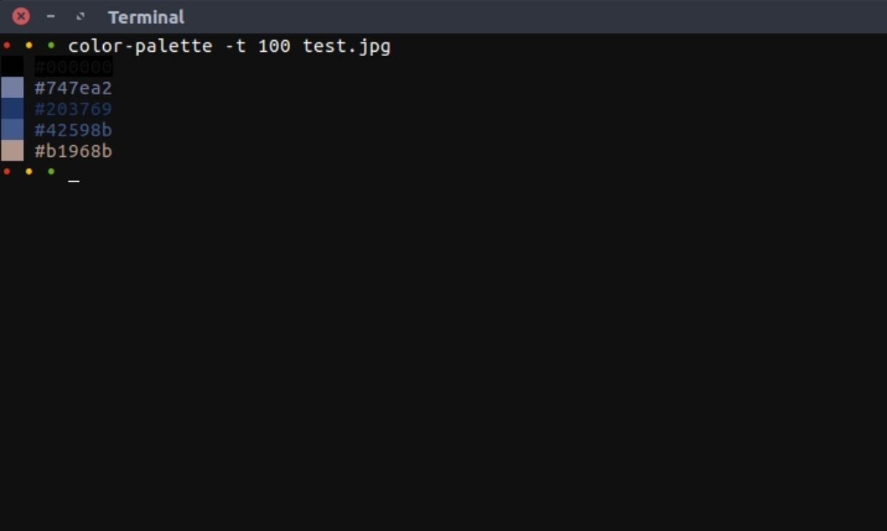

# sudo-make-me-a-sandwitch
Click and type less. Make your day to day tasks automated.
Inspired by [hacker-scripts](https://github.com/NARKOZ/hacker-scripts).

[1. trending-repos](https://github.com/mkermani144/sudo-make-me-a-sandwitch/blob/master/trending-repos.py)  
----
This script opens top 6 today's trending github repos in your browser.

[2. color-palette](https://github.com/mkermani144/sudo-make-me-a-sandwitch/blob/master/color-palette.py)  
----
This script generates a color palette containing the colors which are most used
in a picture.

